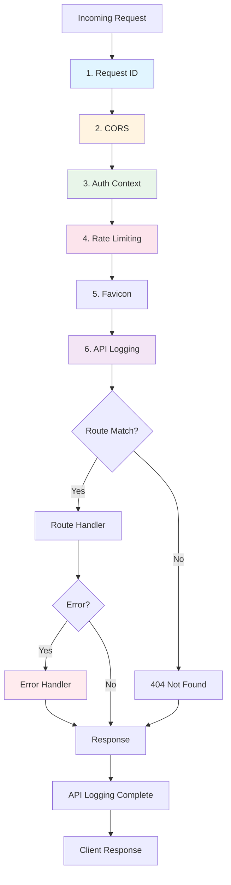
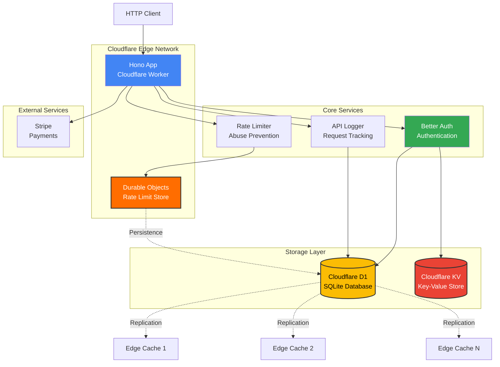
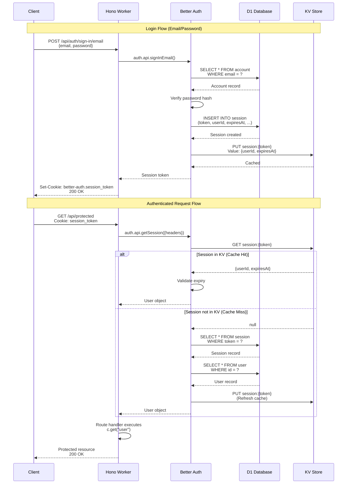
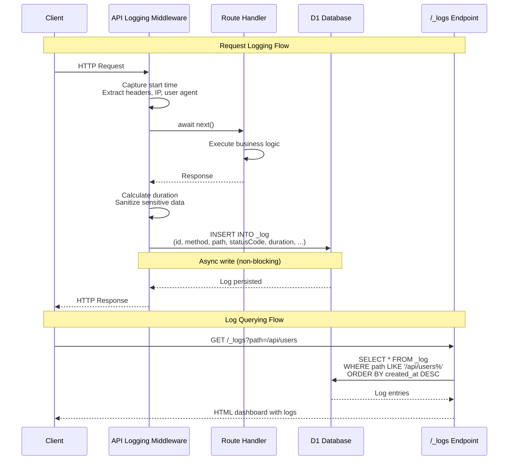
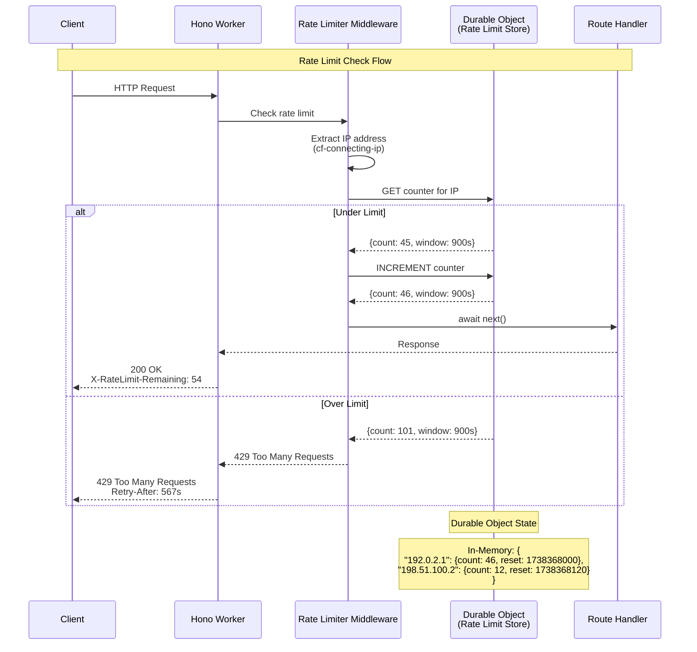
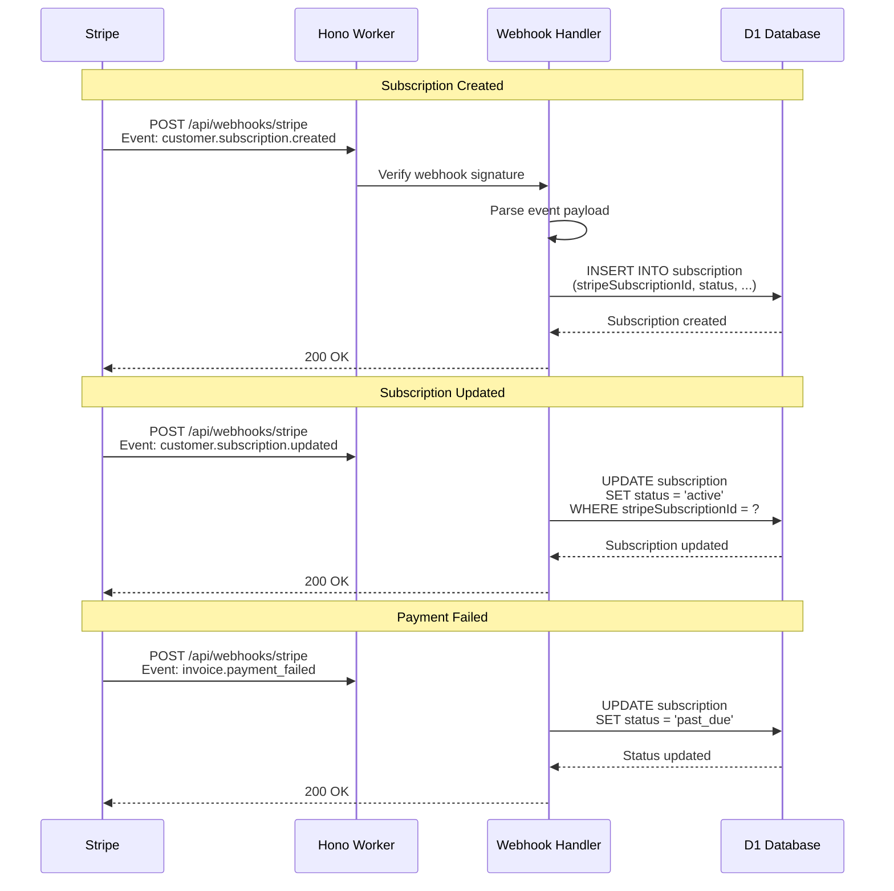

# System Architecture

**Goal:** Document the system design, component relationships, and deployment topology of this Hono.js + Cloudflare Workers white-label template.

## Overview

This is a **white-label starter template** built for deploying production-grade serverless APIs on Cloudflare's global edge network. It provides a complete foundation for building multi-tenant SaaS applications with authentication, payments, rate limiting, and comprehensive API documentation.

The architecture leverages Cloudflare Workers for edge computing, D1 for serverless SQLite databases, KV for distributed caching, and Durable Objects for stateful coordination. The application is built with Hono.js for ultra-fast request handling and Better Auth for comprehensive authentication capabilities.

## 1) Technology Stack

### Core Framework & Runtime
- **Hono.js** (v4.7+) - Ultra-fast web framework optimized for edge computing
  - Minimal overhead (~15KB), faster routing than Express
  - Full TypeScript support with path aliases (`@/*` maps to `./src/*`)
  - OpenAPI integration via `@hono/zod-openapi`
  - Middleware-based architecture for composable request handling

- **Cloudflare Workers** - Serverless execution environment
  - V8 isolates for instant cold starts (<1ms)
  - Global deployment across 300+ edge locations
  - Smart Placement for compute location optimization
  - Automatic scaling and DDoS protection

### Authentication & Authorization
- **Better Auth** (v1.2+) - Modern authentication library
  - **Core Features:** Email/password, passkeys (WebAuthn), 2FA, anonymous users
  - **Multi-tenant:** Organization plugin for SaaS applications
  - **Admin System:** Role-based access control with admin plugin
  - **Cloudflare Adapter:** Custom adapter (`better-auth-cloudflare`) for D1/KV integration
  - **Session Management:** 7-day expiry with 1-day update intervals
  - **Database Tables:** `user`, `session`, `account`, `verification`, `passkey`, `member`, `organization`, `invitation`

### Database & Storage
- **Cloudflare D1** - Serverless SQLite at the edge
  - Distributed SQLite with automatic replication
  - Pay-per-use pricing (free tier: 5 million reads/day)
  - Eventual consistency model for edge reads
  - Strong consistency for writes via central coordination

- **Drizzle ORM** (v0.44+) - Type-safe database operations
  - Schema-first design with TypeScript inference
  - Migration system with SQL generation (`drizzle-kit generate`)
  - Support for D1-specific features (SQLite dialect)
  - Query builder with full type safety
  - Schema file: `src/db/schema.ts`

- **Cloudflare KV** - Distributed key-value storage
  - Global low-latency reads (<100ms p50)
  - Eventual consistency (up to 60s propagation)
  - Use cases: Session storage, API caching, feature flags
  - Free tier: 100k reads/day, 1k writes/day

### API & Validation
- **Zod** (v3.25+) - Runtime validation and type inference
  - Schema validation for request/response data
  - OpenAPI schema generation via `@hono/zod-openapi`
  - Type-safe error messages
  - Integration with Drizzle for database schemas

- **Stoker** (v1.4+) - OpenAPI utilities for Hono
  - Pre-built middleware: `notFound`, `onError`, `serveEmojiFavicon`
  - OpenAPI hooks: `defaultHook` for consistent error handling
  - Response helpers with type inference

- **Scalar API Reference** (v0.9+) - Interactive API documentation
  - Modern alternative to Swagger UI
  - Auto-generated from OpenAPI spec
  - Available at `/reference` endpoint

### Payment Processing
- **Stripe** - Payment and subscription management
  - Webhook handling for subscription events
  - Customer portal integration
  - Test mode support for development
  - Subscription lifecycle management (active, canceled, past_due)

### Rate Limiting & Coordination
- **Cloudflare Durable Objects** - Stateful coordination primitives
  - Global singleton instances for distributed locking
  - Used for rate limiting via `CloudflareRateLimitStore`
  - Strong consistency guarantees
  - WebSocket support for real-time features

- **hono-rate-limiter** (v0.4+) - Request throttling
  - IP-based rate limiting (100 requests per 15 minutes default)
  - Cloudflare-specific IP detection (`cf-connecting-ip`)
  - Custom store implementation using Durable Objects
  - Configurable windows and limits per route

### Logging & Observability
- **API Logging** - Request/response logging to D1
  - Automatic logging via `apiLoggingMiddleware`
  - Stores: method, path, status, duration, user context, IP address
  - Sensitive data sanitization (passwords, tokens, API keys)
  - Query dashboard at `/_logs` endpoint
  - Schema: `apiLogs` table in `src/db/schema.ts`

- **Request IDs** - Distributed tracing
  - Auto-generated via `hono/request-id` middleware
  - Propagated through headers: `X-Request-Id`
  - Used for correlating logs across services

### Development Tools
- **Wrangler** (v4.44+) - Cloudflare CLI for deployment
  - Local development: `wrangler dev`
  - Remote deployment: `wrangler deploy`
  - Secret management: `wrangler secret put`
  - D1 migrations: `wrangler d1 migrations apply`

- **TypeScript** (v5.8+) - Static type checking
  - Strict mode enabled
  - Path aliases configured in `tsconfig.json`
  - `@cloudflare/workers-types` for runtime type definitions

- **ESLint** - Code linting
  - `@antfu/eslint-config` - Opinionated configuration
  - Custom rules: kebab-case filenames, no `process.env`, sorted imports
  - Auto-fixing via `eslint-plugin-format`

- **Vitest** (v3.2+) - Unit and integration testing
  - Fast test execution with Vite-powered transforms
  - `createTestApp()` helper for route testing
  - Environment support (`.env.test`)

## 2) System Design Principles

### Edge-First Architecture
All compute runs on Cloudflare's edge network, minimizing latency for global users. Database reads are served from nearby edge locations, while writes coordinate through a central point for consistency.

### Type Safety Throughout
TypeScript types flow from database schema → API validation → OpenAPI spec → client types. Changes to the schema automatically propagate through the stack, preventing runtime errors.

### Middleware Composition
The application uses a layered middleware stack where each layer has a single responsibility:
1. **Request ID** - Tracing and correlation
2. **CORS** - Cross-origin resource sharing
3. **Auth Context** - User authentication (optional by default)
4. **Rate Limiting** - Abuse prevention
5. **API Logging** - Request/response persistence

Each middleware is independently testable and can be enabled/disabled per route.

### Separation of Concerns
- **Route handlers** (`src/routes/`) - Business logic and API endpoints
- **Middleware** (`src/middlewares/`) - Cross-cutting concerns (auth, logging, rate limiting)
- **Database** (`src/db/`) - Schema definitions and migrations
- **Authentication** (`src/auth/`) - Better Auth configuration
- **Libraries** (`src/lib/`) - Shared utilities (app factory, OpenAPI config)

### Environment-Specific Configuration
- **Local Development:** `.dev.vars` for secrets, `wrangler.toml` for bindings
- **Remote Deployment:** Cloudflare secrets dashboard, `wrangler.toml` for resource names
- **Testing:** `.env.test` for test-specific configuration

## 3) Key Architectural Decisions

### Why Hono over Express?
- **Performance:** 3-4x faster routing, minimal memory footprint
- **Edge Compatibility:** Works natively in V8 isolates (no Node.js APIs)
- **Type Safety:** First-class TypeScript support with automatic type inference
- **OpenAPI Integration:** Built-in support via `@hono/zod-openapi`

### Why D1 over PostgreSQL?
- **Edge Reads:** SQLite can be replicated to edge locations for low-latency reads
- **Simplicity:** No connection pooling, no database servers to manage
- **Cost:** Free tier covers most small-to-medium applications
- **Drizzle Support:** Full ORM support with migrations

### Why Better Auth?
- **Cloudflare Compatible:** Works in Workers runtime (no Node.js dependencies)
- **Plugin System:** Modular features (passkeys, 2FA, organizations)
- **Type Safe:** Full TypeScript support with type inference
- **Flexible:** Supports multiple authentication methods and custom adapters

### Why Durable Objects for Rate Limiting?
- **Global Consistency:** Single source of truth for rate limit counters
- **Statefulness:** Maintains counters in memory for fast access
- **Reliability:** Automatic failover and replication

## 4) Request Flow & Middleware Stack

Every incoming HTTP request passes through a carefully orchestrated middleware pipeline defined in `src/lib/create-app.ts`. Each middleware layer handles a specific cross-cutting concern before reaching the route handler.

### Request Lifecycle Diagram



### Middleware Execution Order

The middleware stack is registered in `createApp()` via the Hono `.use()` method:

```typescript
// From src/lib/create-app.ts
export default function createApp(): OpenAPIHono<AppBindings> {
  const app = createRouter();
  app
    .use(requestId())                      // Layer 1
    .use(createDynamicCorsMiddleware())    // Layer 2
    .use("*", async (c, next) => { ... })  // Layer 3
    .use(rateLimiter({ ... }))             // Layer 4
    .use(serveEmojiFavicon("📝"))          // Layer 5
    .use(apiLoggingMiddleware());          // Layer 6

  app.notFound(notFound);                  // 404 handler
  app.onError(onError);                    // Error handler
  return app;
}
```

### Layer-by-Layer Breakdown

#### 1. Request ID (`requestId`)
**Purpose:** Generate unique identifier for request tracing
**Source:** `hono/request-id`
**Code Reference:** `src/lib/create-app.ts:48`

- Generates a UUID for each request
- Adds `X-Request-Id` header to response
- Enables correlation across distributed logs
- Used by API logging middleware to track requests

```typescript
app.use(requestId())
```

#### 2. CORS (`createDynamicCorsMiddleware`)
**Purpose:** Enable cross-origin resource sharing
**Source:** Custom wrapper around `hono/cors`
**Code Reference:** `src/lib/create-app.ts:39-47`, implementation at lines 18-37

- Dynamically resolves allowed origins from `env.CORS_ORIGINS`
- Supports comma-separated string or array of origins
- Defaults to `*` (allow all) if not configured
- Allows credentials and standard HTTP methods
- Configurable max age via `env.CORS_MAX_AGE` (default: 86400s)

```typescript
.use(createDynamicCorsMiddleware())

// Dynamic configuration
function resolveCorsOrigins(env) {
  // Supports: "https://app.com,https://admin.com"
  // Or: ["https://app.com", "https://admin.com"]
  // Fallback: "*"
}
```

#### 3. Auth Context (`Better Auth`)
**Purpose:** Initialize authentication context for request
**Source:** Custom middleware using `createAuth()` helper
**Code Reference:** `src/lib/create-app.ts:49-54`

- Creates Better Auth instance with access to D1/KV bindings
- Extracts Cloudflare request metadata (geolocation, IP, etc.)
- Stores auth instance in context via `c.set("auth", auth)`
- **Does NOT require authentication** - only sets up the context
- Actual authentication enforcement happens in route-level middleware

```typescript
.use("*", async (c, next) => {
  const cf = (c.req.raw as Request & { cf?: IncomingRequestCfProperties }).cf;
  const auth = createAuth(c.env, cf);
  c.set("auth", auth);
  await next();
})
```

**Important:** This middleware runs globally but is **non-blocking**. Routes that need authentication must use `authMiddleware` from `src/middlewares/auth.ts`.

#### 4. Rate Limiting (`rateLimiter`)
**Purpose:** Prevent abuse via IP-based request throttling
**Source:** `hono-rate-limiter` with custom Durable Objects store
**Code Reference:** `src/lib/create-app.ts:55-62`

- Default limit: **100 requests per 15 minutes per IP**
- Uses `CloudflareRateLimitStore` backed by Durable Objects
- IP detection priority:
  1. `cf-connecting-ip` (Cloudflare's real IP header)
  2. `x-forwarded-for`
  3. `x-real-ip`
  4. `host` header
  5. Fallback: `"unknown"`
- Returns `429 Too Many Requests` when limit exceeded
- Durable Objects ensure global consistency across edge locations

```typescript
.use(rateLimiter({
  windowMs: 15 * 60 * 1000,  // 15 minutes
  limit: 100,                 // 100 requests max
  store: new CloudflareRateLimitStore(),
  keyGenerator: (c) => c.req.header("cf-connecting-ip") ?? ...
}))
```

#### 5. Favicon (`serveEmojiFavicon`)
**Purpose:** Serve emoji favicon for browser requests
**Source:** `stoker/middlewares`
**Code Reference:** `src/lib/create-app.ts:63`

- Lightweight middleware for serving `📝` emoji as favicon
- Prevents 404 errors for `/favicon.ico` requests
- No impact on API performance (only matches favicon path)

```typescript
.use(serveEmojiFavicon("📝"))
```

#### 6. API Logging (`apiLoggingMiddleware`)
**Purpose:** Log all requests/responses to D1 database
**Source:** Custom middleware
**Code Reference:** `src/lib/create-app.ts:64`, implementation in `src/middlewares/api-logger.ts`

- Captures request metadata: method, path, headers, IP, user agent
- Measures request duration (start to finish)
- Logs response status and size
- Associates requests with authenticated users (if available)
- Sanitizes sensitive data (passwords, tokens, API keys)
- Stores in `apiLogs` table in D1
- Dashboard available at `/_logs` endpoint

**Execution Flow:**
1. Starts timer before request
2. Calls `await next()` to execute route handler
3. Calculates duration after response
4. Inserts log entry into D1 (async, non-blocking)

```typescript
.use(apiLoggingMiddleware())
```

### Error Handling

#### 404 Not Found (`notFound`)
**Purpose:** Handle requests to non-existent routes
**Source:** `stoker/middlewares`
**Code Reference:** `src/lib/create-app.ts:67`

- Returns consistent JSON error response
- Status: `404 Not Found`
- Includes request path in error message

```typescript
app.notFound(notFound);
```

#### Global Error Handler (`onError`)
**Purpose:** Catch and format all uncaught errors
**Source:** `stoker/middlewares`
**Code Reference:** `src/lib/create-app.ts:68`

- Catches exceptions from any middleware or route handler
- Returns structured JSON error response
- Prevents stack traces from leaking in production
- Logs errors for debugging

```typescript
app.onError(onError);
```

### Middleware Bypassing

Some routes may need to bypass certain middleware layers:

- **Bypass Auth:** All routes bypass auth by default (it's optional). Use `authMiddleware` to enforce authentication.
- **Bypass Rate Limiting:** Not currently supported globally, but can be configured per-route.
- **Bypass API Logging:** Certain paths can be excluded in `apiLoggingMiddleware` implementation.

### Performance Characteristics

- **Request ID:** ~0.1ms overhead (UUID generation)
- **CORS:** ~0.2ms overhead (header parsing)
- **Auth Context:** ~0.5ms overhead (instance creation)
- **Rate Limiting:** ~1-5ms overhead (Durable Objects call)
- **API Logging:** ~5-15ms overhead (D1 write, async)

**Total overhead:** ~7-20ms per request, depending on D1 latency.

### Testing Middleware

Use the `createTestApp()` helper to test routes with the full middleware stack:

```typescript
// From src/lib/create-app.ts:72-76
export function createTestApp<S extends Schema>(router: AppOpenAPI<S>) {
  const app = createApp();
  return app.route("/", router);
}
```

This ensures integration tests run with the same middleware configuration as production.

## 5) Component Relationships & Data Flow

This section describes how the major system components interact with each other and the data flow patterns for critical operations.

### System Component Diagram



### Component Interaction Matrix

| Component | Interacts With | Purpose | Consistency Model |
|-----------|---------------|---------|-------------------|
| **Hono App** | Better Auth | Session validation, user operations | Strongly consistent |
| **Hono App** | D1 Database | CRUD operations, API logging | Eventually consistent reads |
| **Hono App** | Durable Objects | Rate limit checks | Strongly consistent |
| **Better Auth** | D1 Database | User, session, account storage | Strongly consistent writes |
| **Better Auth** | KV Store | Session caching, rate limiting | Eventually consistent |
| **API Logger** | D1 Database | Request/response persistence | Asynchronous writes |
| **Rate Limiter** | Durable Objects | Request counting | Strongly consistent |
| **Stripe** | D1 Database | Subscription state sync | Webhook-driven |

### Data Flow: Authentication System

The authentication system uses Better Auth with a custom Cloudflare adapter that integrates D1 and KV storage.



**Key Authentication Components:**

1. **Better Auth Instance Creation** (`src/auth/index.ts`)
   ```typescript
   export function createAuth(env, cf) {
     const db = drizzle(env.DATABASE, { schema, logger: true });
     return betterAuth({
       ...withCloudflare({
         d1: { db, options: { usePlural: false } },
         kv: env.KV,
         cf: cf || {},
       }),
     });
   }
   ```

2. **Session Storage Strategy**
   - **Primary Store:** D1 `session` table (source of truth)
   - **Cache Layer:** KV store (low-latency reads)
   - **TTL:** 7 days session expiry, 1 day update interval
   - **Geolocation:** Captured from Cloudflare `cf` object (city, country, latitude, longitude)

3. **Database Schema** (`src/db/schema.ts`)
   - **user table:** Core user identity (id, email, emailVerified, stripeCustomerId)
   - **session table:** Active sessions with geolocation tracking
   - **account table:** OAuth providers and password storage
   - **verification table:** Email verification tokens
   - **passkey table:** WebAuthn credentials for passwordless login

4. **Authentication Middleware Flow**
   - **Global Context Setup:** `createAuth()` runs on every request (non-blocking)
   - **Route Protection:** `authMiddleware` enforces authentication where needed
   - **User Access:** `c.get("user")` provides type-safe user object in handlers

### Data Flow: API Logging System

All API requests are logged to D1 for analytics, debugging, and audit trails.



**API Logging Implementation Details:**

1. **Middleware Execution** (`src/middlewares/api-logger.ts`)
   - Wraps route handler with timing logic
   - Runs **after** all other middleware (last in chain)
   - Non-blocking async insert to D1 (doesn't delay response)

2. **Data Captured** (`apiLogs` schema in `src/db/schema.ts`)
   ```typescript
   {
     id: text("id").primaryKey(),
     method: text("method").notNull(),        // GET, POST, PUT, DELETE
     url: text("url").notNull(),              // Full URL
     path: text("path").notNull(),            // Route path
     statusCode: integer("status_code"),      // 200, 404, 500, etc.
     duration: integer("duration"),           // Milliseconds
     ipAddress: text("ip_address"),           // Client IP
     userAgent: text("user_agent"),           // Browser/client info
     requestBody: text("request_body"),       // Sanitized JSON
     responseBody: text("response_body"),     // Sanitized JSON
     errorMessage: text("error_message"),     // If error occurred
   }
   ```

3. **Sensitive Data Sanitization**
   - Strips fields: `password`, `token`, `apiKey`, `secret`, `authorization`
   - Applied to both request and response bodies
   - Prevents credential leakage in logs

4. **Query Optimization** (Index Strategy)
   ```sql
   CREATE INDEX idx_api_logs_path_created_at ON _log(path, created_at);
   CREATE INDEX idx_api_logs_path_method ON _log(path, method);
   CREATE INDEX idx_api_logs_path_status ON _log(path, statusCode);
   ```
   - Optimized for filtering by path (most common query)
   - Supports time-range queries for analytics
   - Composite indexes for multi-column filters

5. **Log Dashboard** (`/_logs` endpoint)
   - Paginated query interface
   - Filter by: path, method, status code, date range
   - Shows: request/response bodies, duration, errors
   - Real-time debugging tool for development

### Data Flow: Rate Limiting System

Rate limiting uses Cloudflare Durable Objects to maintain global request counters per IP address.



**Rate Limiting Architecture:**

1. **Durable Objects as State Store**
   - Each Durable Object instance maintains in-memory counters
   - Global singleton per IP address (consistent across edge locations)
   - Automatic persistence to durable storage
   - Survives Worker restarts

2. **Configuration** (`src/lib/create-app.ts`)
   ```typescript
   rateLimiter({
     windowMs: 15 * 60 * 1000,  // 15-minute window
     limit: 100,                 // 100 requests per window
     keyGenerator: (c) =>
       c.req.header("cf-connecting-ip") ?? "unknown"
   })
   ```

3. **IP Address Detection Priority**
   1. `cf-connecting-ip` - Cloudflare's real client IP (most reliable)
   2. `x-forwarded-for` - Proxy chain (first IP)
   3. `x-real-ip` - Alternative proxy header
   4. `host` - Fallback to hostname
   5. `"unknown"` - Last resort (all unknowns share one limit)

4. **Rate Limit Headers**
   - `X-RateLimit-Limit: 100` - Max requests per window
   - `X-RateLimit-Remaining: 54` - Requests left in current window
   - `X-RateLimit-Reset: 1738368000` - Unix timestamp when window resets
   - `Retry-After: 567` - Seconds until client can retry (on 429)

5. **Durable Object Lifecycle**
   ```
   Request → Worker identifies IP → Hash IP to Durable Object ID →
   Cloudflare routes to existing DO or creates new one →
   DO checks in-memory counter → Updates counter → Returns result
   ```

6. **Performance Characteristics**
   - **Latency:** ~1-5ms per rate limit check (Durable Object call)
   - **Scalability:** Unlimited IPs (Durable Objects auto-scale)
   - **Consistency:** Strong consistency (single source of truth per IP)
   - **Durability:** Counters persisted to durable storage every few seconds

### Data Flow: Stripe Webhook Processing

Stripe webhooks synchronize subscription state from Stripe to the D1 database.



**Stripe Integration Components:**

1. **Subscription Schema** (`src/db/schema.ts`)
   ```typescript
   export const subscription = sqliteTable("subscription", {
     id: text("id").primaryKey(),
     referenceId: text("reference_id").references(() => user.id),
     stripeCustomerId: text("stripe_customer_id"),
     stripeSubscriptionId: text("stripe_subscription_id").unique(),
     status: text("status").notNull(),  // active, canceled, past_due
     periodStart: integer("period_start", { mode: "timestamp" }),
     periodEnd: integer("period_end", { mode: "timestamp" }),
     cancelAtPeriodEnd: integer("cancel_at_period_end", { mode: "boolean" }),
   });
   ```

2. **Webhook Event Types Handled**
   - `customer.subscription.created` - New subscription started
   - `customer.subscription.updated` - Status/plan change
   - `customer.subscription.deleted` - Subscription canceled
   - `invoice.payment_succeeded` - Payment processed successfully
   - `invoice.payment_failed` - Payment declined or failed

3. **User Relationship**
   - `user.stripeCustomerId` links to Stripe Customer ID
   - `subscription.referenceId` links to `user.id`
   - One user can have multiple subscriptions (current + historical)

### Cross-Component Data Dependencies

**Dependency Graph:**

```
User Authentication (Better Auth)
  ↓ depends on
D1 Database (user, session, account tables)
  ↓ depends on
Database Migrations (Drizzle Kit)

API Logging (Middleware)
  ↓ depends on
D1 Database (_log table)
  ↓ depends on
Request Context (user, IP, timing)

Rate Limiting (Middleware)
  ↓ depends on
Durable Objects (CloudflareRateLimitStore)
  ↓ may persist to
D1 Database (future: rate_limit_events table)

Stripe Subscriptions (Webhooks)
  ↓ depends on
User Table (stripeCustomerId)
  ↓ depends on
Authentication System (user creation)
```

**Initialization Order:**

1. **Environment Validation** - Zod schemas validate `env` bindings
2. **Database Connection** - Drizzle initializes D1 connection
3. **Better Auth Setup** - Auth instance created with D1/KV bindings
4. **Middleware Stack** - Request ID → CORS → Auth Context → Rate Limit → Logging
5. **Route Registration** - API routes mounted on Hono app
6. **OpenAPI Generation** - Schema exported for documentation

**Critical Path Dependencies:**

- **Authentication requires:** D1 (session storage), KV (session cache)
- **API Logging requires:** D1 (_log table), Request ID (correlation)
- **Rate Limiting requires:** Durable Objects (counter storage), IP detection
- **Stripe Webhooks require:** D1 (subscription table), User table (foreign key)

**Failure Modes:**

| Component Failure | Impact | Mitigation |
|-------------------|--------|------------|
| D1 Database down | Authentication fails, logs lost | KV session cache provides temporary auth |
| KV Store down | Slower auth (cache miss), rate limit degraded | Falls back to D1 for sessions |
| Durable Objects down | Rate limiting disabled | Requests proceed without throttling |
| Stripe webhook fails | Subscription state stale | Stripe retry policy (exponential backoff) |

## Next Sections

This document will be expanded with:
- **Authentication System** - Detailed Better Auth plugin configuration
- **Deployment Topology** - Cloudflare Workers deployment and bindings
- **Database Schema** - Table relationships and migration workflow
- **Configuration** - Environment variables and secrets management

---
*Last Updated: 2026-01-31*
